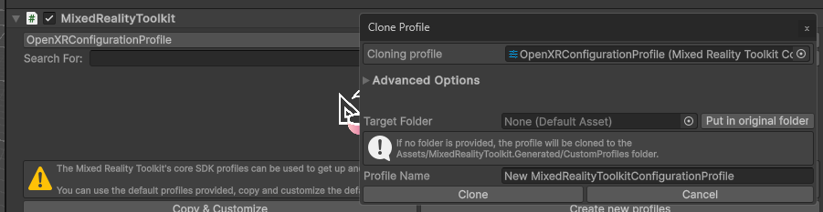
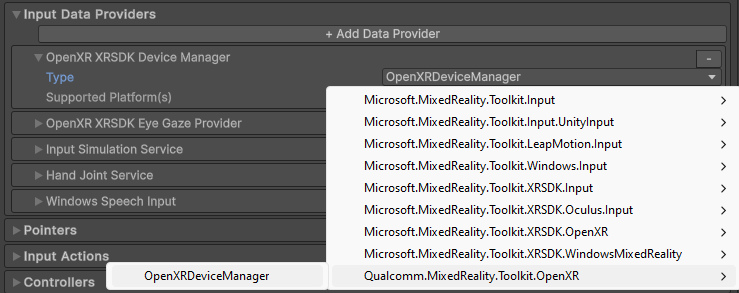
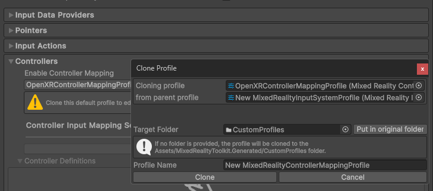
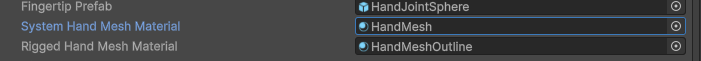

# Upgrade MRTK2 with Android XR support

1. Open your working Snapdragon Spaces or OpenXR-compatible profile (or clone the built-in OpenXRConfigurationProfile, if you don't already have a custom profile for OpenXR).

    

1. Open your working Snapdragon Spaces or OpenXR-compatible input system profile (or clone the built-in OpenXRInputSystemProfile, if you don't already have a custom profile for OpenXR).

    

1. Expand your input data providers and update your existing OpenXR XRSDK Device Manager to the new OpenXRDeviceManager under the `Qualcomm.MixedReality.Toolkit.OpenXR` namespace.
    1. This new device manager remains compatible with the same platforms supported by the previous device manager, but now includes expanded support for new platforms, like Android XR.

    

1. Expand your controller mappings (or clone the built-in OpenXRControllerMappingProfile, if you don't already have a custom profile for OpenXR) and run the Controller Mapping Profiles updater.

    

    

1. Ensure `Qualcomm.MixedReality.Toolkit.OpenXR.OpenXRArticulatedHand` is present in the "Articulated Left/Right Hand Controller" mapping.

    

1. If you're using the MRTK2 hand mesh material/shader, you may need to change to a different one. The current shader may not render properly on Android XR.
    1. Update your existing custom profile or clone the default and update System Hand Mesh Material.

    

    

1. Ensure Android XR Extensions for Unity (com.google.xr.extensions) is installed, if you need the visible hand mesh.
    1. Either import it manually by git URL: <https://github.com/android/android-xr-unity-package.git>
    1. Or use the MRTK2 helper "Configure for Android XR...".

        

1. Open your OpenXR project settings and ensure you're on the Android tab.
    1. For OpenXR spec-conformant use of this package, ensure the MRTK2 Input Focus feature is enabled.
        1. There is a Project Validation rule to enforce this which will cause a build error if not enabled.
    1. For hand interactions (airtap, grab, etc.), ensure the Hand Interaction Profile is enabled.
    1. For hand joint tracking, ensure Hand Tracking Subsystem is checked.
    1. For hand mesh, ensure Android XR (Extensions): Hand Mesh and Android XR (Extensions): Session Management are checked.

    

1. Build and deploy!
